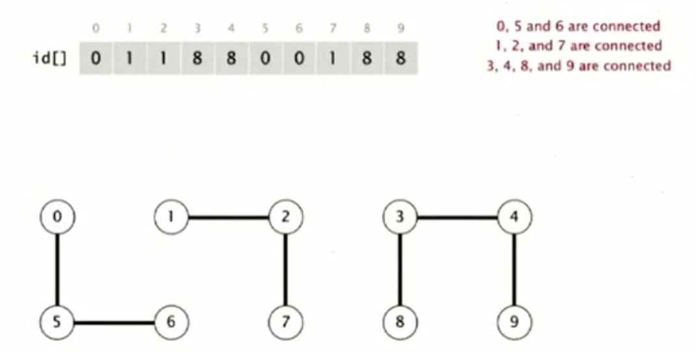
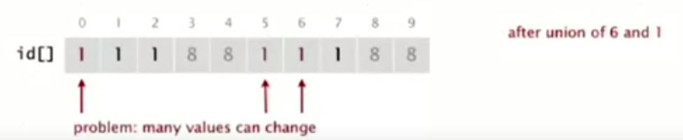

# Dynamic Connectivity 문제 해결을 위한 Quick Find 알고리즘


## Quick Find [eager approach]

이 알고리즘은 조급한(eager) 알고리즘이라고도 한다.

* 데이터 구조 
    - N개의 정수 배열을 가진다.
    - p와 q가 연결되어 있다면, 같은 id를 가진다는 뜻이다.



위의 그림에선 0,5,6이 연결되어있는데, 이것을 배열 id[0], id[5], id[6] 번지에 0으로 같은 값을 저장해서 연결되어 있음을 나타낸다.

* id[0] = id[5] = id[6] = 0
* id[1] = id[2] = id[7] = 1
* id[3] = id[4] = id[8] = id[9] = 8

<br/>
<br/>

## connected

연결 확인 명령은 같은 값을 갖고 있는지만 확인하면 된다.<br/>
위의 그림을 기준으로 확인해보면,<br/>

connected(0, 6) => true (`0으로 같은 값을 가짐`)<br/>
connected(6, 1) => false (`6번지에는 0, 1번지에는 1이 저장되어 있어서 연결 안됨`)

<br/>
<br/>

## union

{0, 5, 6} 그룹과 {1, 2, 7} 그룹을 합치기 위해 1, 6을 연결한다고 해보자.<br/>
그럼 {0, 5, 6} 그룹에 1을 저장하던지, {1, 2, 7}그룹에 0을 저장해야할 것이다.


그림에선 {0, 5, 6}그룹에 1을 저장해서 {1, 2, 7} 그룹과 같은 값으로 연결을 시켜주었다.<br/>
이 알고리즘은 크나큰 문제가 있는데, 배열을 한번 순회해야 하기 때문에 배열의 크기가 클수록 , 바꿔야 할 값이 많을수록 성능의 저하가 발생할 수밖에 없다.

<br/>
<br/>
<br/>

## 구현
```java
//UnionFind 알고리즘 모델링
public abstract class UnionFind {

    protected int[] ids;

    public UnionFind(int N) {
        ids = new int[N];
    }

    public abstract void union(int p, int q);
    public abstract boolean connected(int p, int q);
}

//QuickFind 알고리즘
public class QuickFindUF extends UnionFind {

    public QuickFindUF(int N) {
        super(N);

        //초기화
        for (int i = 0; i < N; i++)
            ids[i] = i;
    }

    public boolean connected(int p, int q) {
        //같은 값인지 확인
        return ids[p] == ids[q];
    }

    public void union(int p, int q) {
        if(!connected(p, q)) {
            int pid = ids[p];
            int qid = ids[q];

            //배열을 순회하면서 값을 변경
            for (int i = 0; i < ids.length; i++)
                if (ids[i] == pid) ids[i] = qid;
        }
    }
}
```

<br/>

## union 연산에 대한 문제

QuickFind는 빠른 찾기라는 이름에서 보듯이, Find 연산은 빠르지만, Union 연산은 성능의 저하가 심하게 나타날 수 있다.<br/>
N개의 객체에 대해 N번의 union 연산을 한다고 가정했을 때, 연산에 걸리는 시간이나 배열의 접근 횟수는 N의 제곱만큼 걸릴 것이다. 그래서 N의 크기가 커질수록 연산 속도는 급격하게 느려질 것이다.<br/>
굳이 이 알고리즘을 써야한다면, N의 크기가 작고 Union 연산보다는 Find 연산을 많이 사용할때가 좋을 것 같다.
