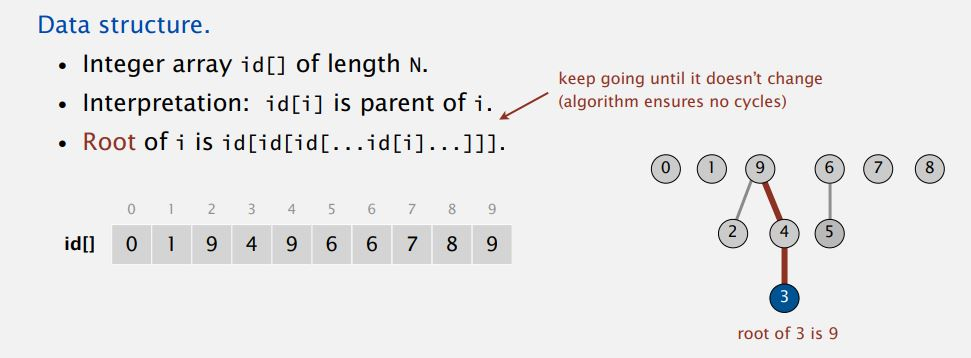
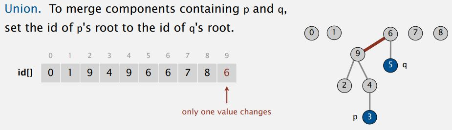

# Dynamic Connectivity 문제 해결을 위한 Quick Union 알고리즘

Quick Find의 union 연산은 큰 데이터에 대해서는 느린 단점이 있다. Quick Union 연산은 이름에서 볼 수 있듯이 `빠른 union 연산을 제공`하는 알고리즘이다. 하지만 find 연산에 대해 느려질 수 있는 단점도 갖고 있다.

## Quick Union [lazy approach]

조급한(eager) 알고리즘과 대비되는 `게으른(lazy) 알고리즘`이다.   
이 알고리즘은 Quick Find의 배열 구조와 다르게 `트리 구조`들의 집합으로 표현한다.

* 데이터 구조 
    - N개의 정수 배열을 가진다.
    - 각 배열에 저장된 값은, 부모의 위치를 나타낸다.
    - 부모를 찾아 올라가다보면 최상위 Root가 나온다.



위의 그림을 보면, 3의 부모는 4이고, 4의 부모는 9이다. 9는 자기 자신을 가리키고 있는데,
부모가 없는 최상위 루트이기 때문이다.


<br/>
<br/>

## Find

연결되어 있는지 확인하려면, `같은 Root 아래에 속해있는지 확인`하면 된다.<br/>
위의 그림을 기준으로 확인해보면, 3과 5는 루트가 각각 9, 6으로 연결 되어있지 않다.

<br/>
<br/>

## union

p와 q를 union 연산을 하면, p의 root에 q의 root를 삽입해서, p의 부모를 q의 root로 지정하면 된다.



위 그림을 기준으로 3과 5를 union 연산.
1. union 3 and 5.
1. 3의 root는 9, 6의 root는 5.
1. 3의 root인 9의 부모로 5의 rot인 6을 삽입.


<br/>
<br/>
<br/>

## 구현
```java
//UnionFind 알고리즘 모델링
public abstract class UnionFind {

    protected int[] ids;

    public UnionFind(int N) {
        ids = new int[N];
    }

    public abstract void union(int p, int q);
    public abstract boolean connected(int p, int q);
}

//QuickUnion 알고리즘
public class QuickUnionUF extends UnionFind {

    public QuickUnionUF(int N) {
        super(N);
        for (int i = 0; i < N; i++)
            ids[i] = i;
    }

    //root 찾기
    private int root(int i) {
        while (i != ids[i])
            i = ids[i];
        return i;
    }

    //연결. (root를 연결)
    @Override
    public void union(int p, int q) {
        int i = root(p);
        int j = root(q);
        ids[i] = j;
    }

    //연결 확인. (같은 root인지 확인)
    @Override
    public boolean connected(int p, int q) {
        return root(p) == root(q);
    }
}
```

<br/>

## Quick Union 알고리즘의 문제

트리의 구조가 아래로 길쭉한 크고 마른(long skinny) 트리인 경우, 맨 아래의 요소에 대한 find 연산은 root를 찾기위한 연산의 수가 많아져서 매우 느려질 수 있다.


