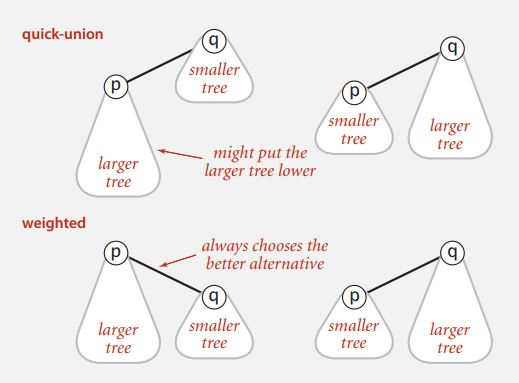
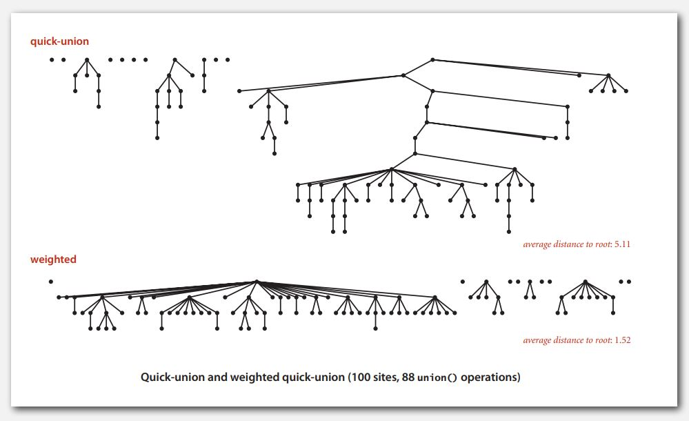
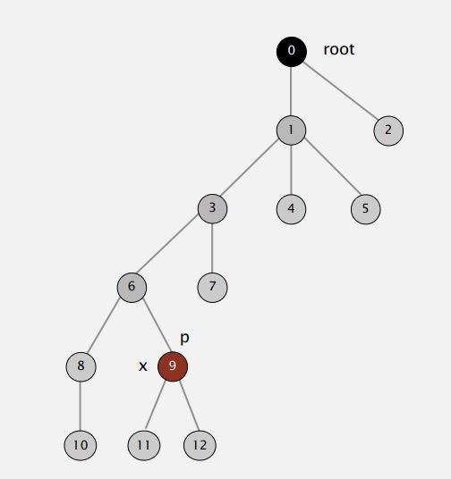
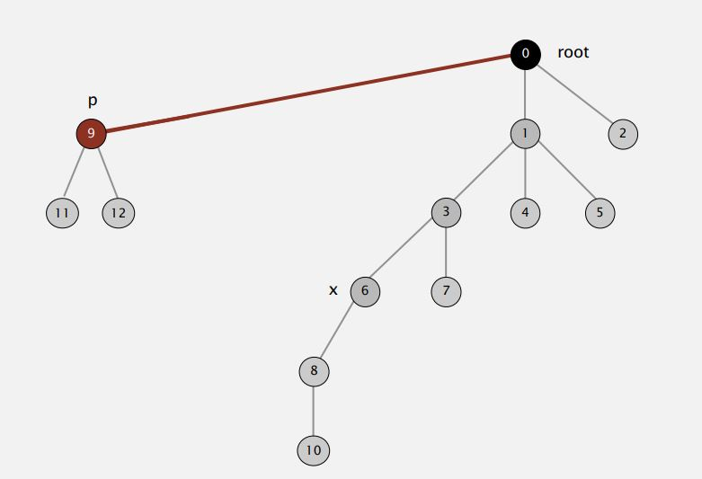
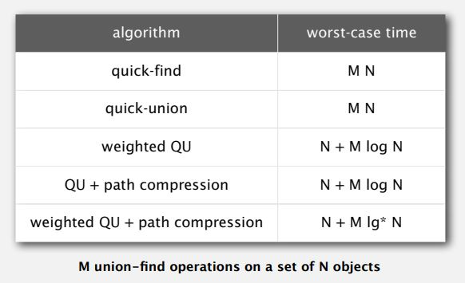

# Quick Union 알고리즘 개선

## 가중치 할당 기법

`트리가 아래로 길게 커지는걸 방지`하기 위한 기법. union 연산을 할 때, 항상 작은 트리가 큰 트리의 아래로 들어가도록 한다.






<br/>

위의 그림을 보면 Quick Union은 큰 트리가 작은 트리의 아래로 들어갈 수 있기 때문에 트리가 아래로 계속 길어진다. 하지만, 가중치 할당 기법은 항상 작은 트리가 큰 트리의 아래로 들어가서 트리의 길이가 아래로 계속 길어지는것을 방지한다.

* 구현

```java
//Union Find 모델링
public abstract class UnionFind {

    protected int[] id;

    public UnionFind(int N) {
        id = new int[N];

        for (int i = 0; i < N; i++)
            id[i] = i;
    }

    //연결
    public abstract void union(int p, int q);

    //연결 확인
    public abstract boolean connected(int p, int q);
}

public class WeightedQuickUnionUF extends UnionFind{

    //각각 트리의 가중치를 저장
    private int[] sz;

    public WeightedQuickUnionUF(int N) {
        super(N);

        sz = new int[N];

        //가중치를 각 1로 초기화.
        for (int i = 0; i < sz.length; i++)
            sz[i] = 1;
    }

    private int root(int i) {
        while (i != id[i])
            i = id[i];
        return i;
    }

    @Override
    public void union(int p, int q) {
        int i = root(p);
        int j = root(q);
        if (i == q) return;

        //트리의 가중치 비교 (작은 트리의 루트가 큰 트리의 루트에 연결되도록)
        if (sz[i] < sz[j]) {
            id[i] = j;
            sz[j] += sz[i];
        } else {
            id[j] = i;
            sz[i] += sz[j];
        }
    }

    @Override
    public boolean connected(int p, int q) {
        return root(p) == root(q);
    }
}
```

<br/>
<br/>

## 경로 압축 기법

기존 방법들은 특정 노드의 루트를 검색할 때, 부모를 계속 따라가면서 루트를 찾게된다. 경로 압축 방법은 그 노드의 부모를 루트로 지정해 놓는 것이다. 그래서 `루트를 찾는 속도를 빠르게 만드는 것`이 경로 압축 기법이다.

<div style="vertical-align: middle;">
    
    ->
    
</div>

그림을 보면 9번 노드의 root를 한번 찾은 이후엔, 9번 노드의 부모를 root로 지정한다.

* 구현

```java
//Union Find 모델링
public abstract class UnionFind {

    protected int[] id;

    public UnionFind(int N) {
        id = new int[N];

        for (int i = 0; i < N; i++)
            id[i] = i;
    }

    //연결
    public abstract void union(int p, int q);

    //연결 확인
    public abstract boolean connected(int p, int q);
}

public class QuickUnionPathCompressionUF extends UnionFind {

    public QuickUnionPathCompressionUF(int N) {
        super(N);
    }

    private int root(int i) {
        while (i != id[i]) {
            //루트를 찾은 뒤에 부모노드를 루트노드로 저장해놓는다.
            id[i] = id[id[i]];
            i = id[i];
        }
        return i;
    }

    @Override
    public void union(int p, int q) {
        int i = root(p);
        int j = root(q);
        id[i] = j;
    }

    @Override
    public boolean connected(int p, int q) {
        return root(p) == root(q);
    }
}
```

## 정리

총 2가지의 개선법을 봤는데, 궁극적으로 2 방법 모두 root를 찾는 시간이 짧도록 하기 위한 방법이었다. 그래서 2가지 방법을 전부 사용해서 구현하면 수행 시간을 극적으로 짧게 만들 수 있다.

