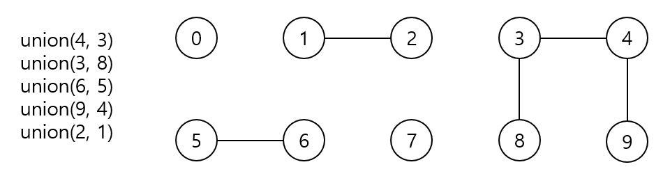
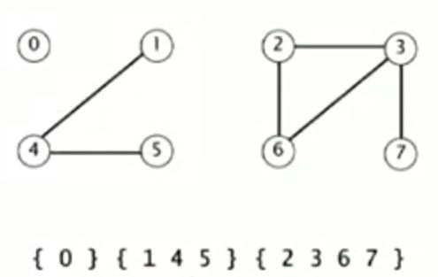

# 동적 연결성 (dynamic connectivity) 문제를 풀기위한 알고리즘

동적 연결성 문제는 UnionFind 알고리즘에 대한 추상적인 모델이다.<br/>
동적 연결성 문제를 확인한 후, UnionFind 대해 모델링하고, 이후 UnionFind를 구현한 `Quick Find`와 `Quick Union`이라는 두 개의 고전 알고리즘을 보고, 응용사례와 성능 향상법을 확인하자.

<br/>

* **알고리즘을 개발하기 위해 따라야할 단계**

1. 문제를 모델링해서 해결 해야할 문제의 주요 요소들이 무엇인지를 기본적으로 이해한다.
1. 그 후, 문제 해결을 위한 몇몇 알고리즘을 떠올릴 수 있다.
1. 속도가 느리거나 메모리가 부족하진 않는지 확인한다. 
1. 소도가 느리거나 메모리가 부족하다면 왜 그런지 이해하고, 문제를 발생시키는 이유들을 찾아내고, 새 알고리즘을 발견한다.
1. 과정을 반복한다.

<br/>

## Dynamic connectivity 문제 확인.



N개의 객체가 주어지고 두 객체간에 연결을 만들어야 한다고 해보자. 그러면 두 개의 객체를 연결하는 명령과 두 객체가 연결이 되어있는지 확인하는 명령 2개가 필요하다.

* 연결 명령 : union(객체1, 객체2)
* 연결 확인 명령 : connected(객체1, 객체2)

위의 그림에 `connected(0, 1)은 false`이고 `connected(1, 2)는 true`가 된다. 또한, `connected(8, 9)도 true`인데, 직접적으로 연결은 되어있지 않지만 간접적으로 연결되어 있다.<br/>
그리고 union(1, 2)명령을 사용하면 1번 객체과 2번 객체는 연결이 되어야한다.<br/>
<br/>
위의 상황은 객체가 10개밖에 되지않아서 쉬워보이지만, 아래 그림처럼 무수히 많은 객체를 연결하고, 연결되어있는지 확인한다면 더이상 눈으로 확인하기는 힘들 것이다.


<br/>
<br/>

* **Union Find 알고리즘을 응용한 사례**
1. 객체가 픽셀로 이루어진 사진 파일에 사용
1. 컴퓨터가 객체인 네트워크
1. 사람이 객체인 소셜 네트워크
1. 회로 요소를 개체도 간주한 컴퓨터 칩
1. 프로그램에서 추상회던 것들을 개체로 간주한 프로그램상의 설계

<br/>
<br/>

## '연결'이 만족해야 할 성질들에 대한 모델링
1. 반사적 연결 : p는 p와 연결되어있다.
2. 대칭적 연결 : p와 q가 연결되어 있으면, q는 p과 연결되어있다.
3. 간접 연결 : p와 q가 연결되어있고, q와 r이 연결되어있으면, p와 r도 연결되어있다.

<br/>
모델링을 토대로 아래 그림처럼, 연결 요소들끼리 부분집합이 생기게 된다. 그 집합에 포함된 객체끼리는 연결 관계를 갖는다.<br/>


<br/>
<br/>

그러면 연결 연산을 통해 더 큰 그룹의 합집합으로 만들 수 있게 된다.


모델링을 토대로 Class를 구성해보면 아래와 같다.
```java
public abstract class UnionFind {

    int[] ids;

    //union find의 데이터 구조를 초기화 (N개의 배열)
    public UnionFind(int N) {
        ids = new int[N];
    }

    //p와 q를 연결
    public abstract void union(int p, int q);

    //p와 q는 같은 집합에 소속되어 있는지 확인
    public abstract boolean connected(int p, int q);
}
```


